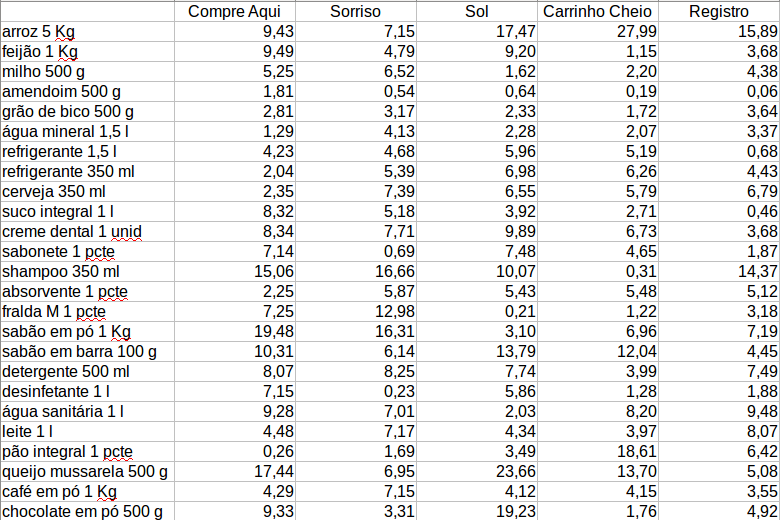

# Get Price

É um projeto de **pesquisa de preços**, escrito em Django...

**Título**

> Economizando dinheiro no Supermercado com Python e Django


## Objetivo

* Retornar os produtos mais baratos de cada supermercado
* Calcular o total da compra em cada supermercado
* Retornar o supermercado mais barato
* Calcular o total da compra no supermercado mais barato
* Retornar os produtos mais baratos em 2 supermercados
* Calcular o total da compra nos 2 supermercados


## Cenário

Para gastar menos você precisa fazer uma pesquisa em vários supermercados, então vamos pesquisar

* 5 produtos por categoria
* 5 categorias
* 5 supermercados
* Todos produtos da mesma marca, mesmo peso e/ou volume, e características idênticas

A partir daí obtemos a seguinte tabela de preço





## Resultado Esperado

* Retornar os produtos mais baratos de cada supermercado


* Calcular o total da compra em cada supermercado


* Retornar o supermercado mais barato
    * RE: Registro


* Calcular o total da compra no supermercado mais barato
    * RE: R$ 454,41

* Retornar os produtos mais baratos em 2 supermercados
    * Pegar os 2 supermercados mais baratos e retornar os produtos mais baratos de cada um
        * RE: Compre Aqui e Registro

* Calcular o total da compra nos 2 supermercados
    * RE: Compre Aqui - R$ 132,75
    * RE: Registro - R$ 147,88
    * RE: Total - R$ 280,63


## Começando

```bash
$ git clone https://github.com/rg3915/getprice.git
$ python -m venv .venv
$ source .venv/bin/activate
$ cd getprice
$ make initial
$ make fixtures
$ ./manage.py runserver
```


## Lição de casa

* Crie um projeto em Django que retorne o produto mais barato por unidade de medida.

* Exemplo 1: Qual é mais barato?
    * 1 fardo com 8 garrafas de água de 1.5 l cada ou
    * 2 garrafas de água de 5 l cada

* Exemplo 2: Qual é mais barato?
    * 1 pacote de papel higiênico com 12 rolos ou
    * 3 pacotes de papel higiênico com 4 rolos


